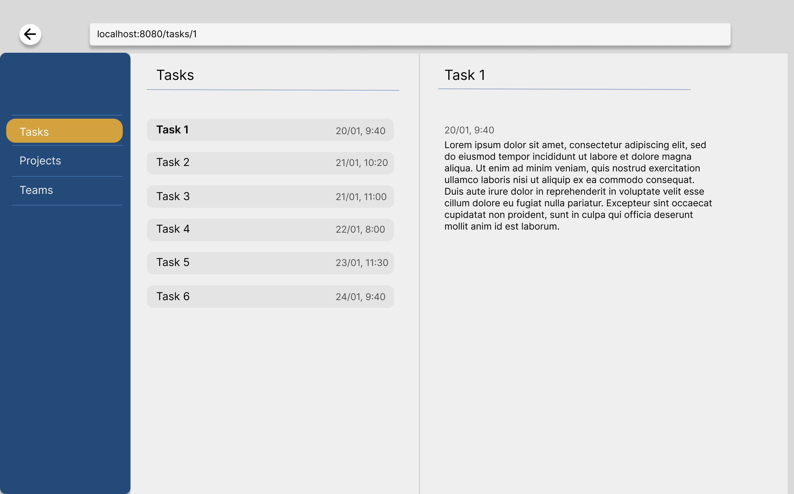

## Programming Assignment

### Implemented Using the Following Packages:
1. Riverpod : state management
2. Freezed : class generation
3. Eazy-Localization: to add English /Arabic locales
4. Responsive-Framework: To make UI responsive for Web, Tablet and Mobile
5. Go-Router: For navigation
6. Google-Fonts : For Fonts
7. AutoSizeTet : For adaptive Texts
8. Dio : For Api handling. 

